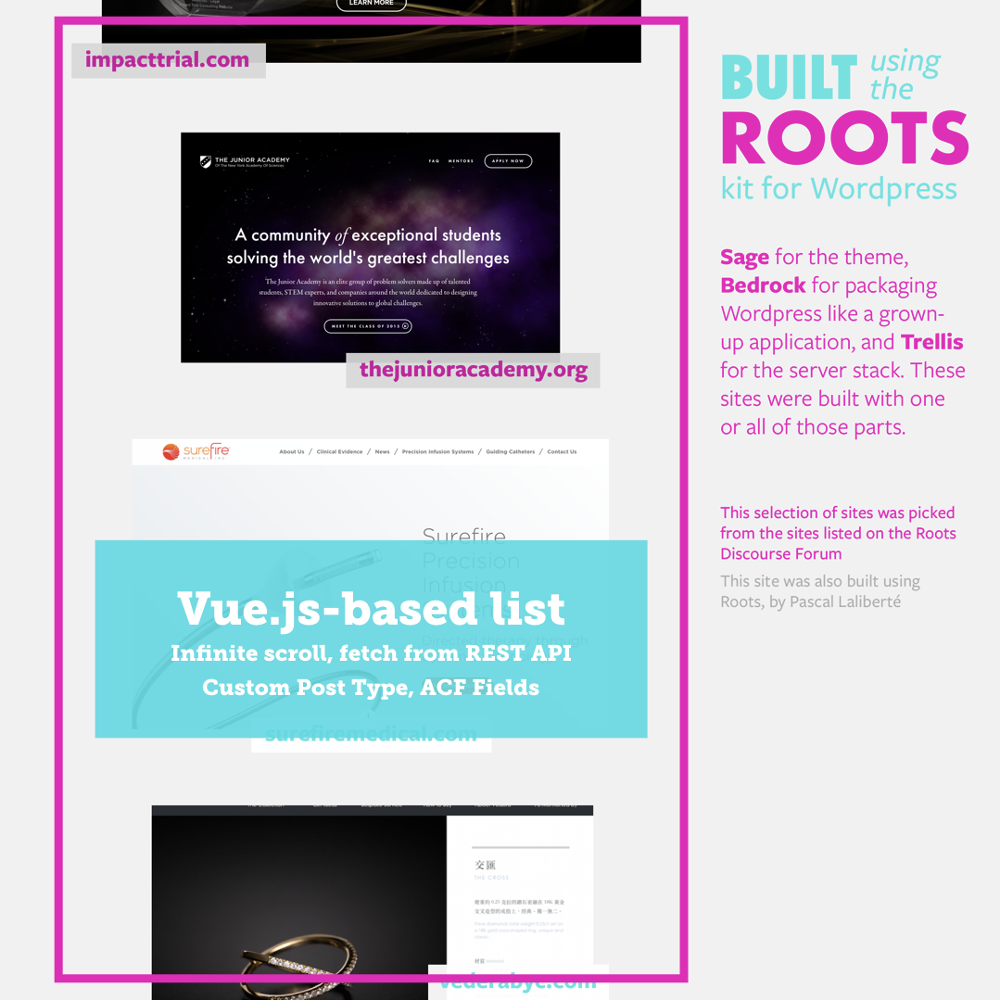

# Built with Roots - a fan site


Help build this fan site of sites built with [Roots][roots], the WordPress development kit of choice for making custom sites.

If you just want to learn Roots, this is a good starter project too. Take it apart!

Here's the presentation that was given on May 17, 2017, demoing the project:

[](https://www.youtube.com/watch?v=c25nvDkblSQ)  
[Undo the Mess: Use Roots for WordPress Dev - May 17, 2017](https://www.youtube.com/watch?v=c25nvDkblSQ)

# Requirements

This is what you'll need to install to run the stack locally:

## For Trellis

Trellis (look in [`trellis/`](trellis/)) is a set of recipes for setting up your servers (using Ansible) and your local development environment (using Vagrant and Virtualbox). Your local dev URL will be [built-with-roots.dev][dev] when vagrant is running.

* [Ansible](http://docs.ansible.com/ansible/intro_installation.html#latest-releases-via-pip) >= 2.2
* [Virtualbox](https://www.virtualbox.org/wiki/Downloads) >= 4.3.10
* [Vagrant](https://www.vagrantup.com/downloads.html) >= 1.8.5
* [vagrant-bindfs](https://github.com/gael-ian/vagrant-bindfs#installation) >= 0.3.1 (Windows users may skip this)
* [vagrant-hostmanager](https://github.com/smdahlen/vagrant-hostmanager#installation)

## For Bedrock

Bedrock (see the [`site/`](site/) directory) organizes your WordPress install in an app-like folder structure with plugins and WordPress itself defined as dependencies.

* [Composer]()

## For the Sage-based theme

This site is built with Sage 9, a theme development kit that works with Sass, ES6-based Javascript using Webpack for builds, Blade templates, Bootstrap 4, and Browsersync. Very cool. Install node and yarn and you'll have what you need to get running. The theme is found in the [`site/web/app/themes/built-with-roots/`](site/web/app/themes/built-with-roots/) directory.

* [Node.js](http://nodejs.org/) >= 6.9.x
* [Yarn](https://yarnpkg.com/en/docs/install)

# Installation

Once all the requirements are installed, go through these steps to download Ansible's and the theme's dependencies. Then, start the local dev server.

## 1. Install Ansible's dependencies

```
# in the trellis/ directory
$ ansible-galaxy install -r requirements.yml
```

## 2. Install the theme's dependencies

```
# in the site/web/app/themes/built-with-roots/ directory
$ composer install
$ yarn install
```

## 3. Build the theme's assets

```
# in the site/web/app/themes/built-with-roots/ directory
$ yarn run build
```

## 4. Start the local dev server

```
# in the trellis/ directory
$ vagrant up
```

The first time (or every time you run `vagrant reload --provision`), this will also install Composer's dependencies.

## 5. Open the site in your browser

Open [built-with-roots.dev][dev]

## 6. Add some content

1. Create a Home Page with an intro
2. Assign the Home Page to be the Front Page
3. Activate the plugins
4. Add new sites in the Sites admin menu with a URL, and a screenshot. You can find sites built with roots in the [Live Example topic of the Roots Discourse Forum][live-examples].

# Theme development

To develop the theme with live-reloading in your browser:

```
# in the trellis/ directory
$ yarn run start
```

Then visit the site in [localhost:3000](http://localhost:3000)

Any changes you make will be injected into the page or will reload the page automatically.

# This site uses Vue.js

The list of site is powered by some Vue.js components so we can get scroll-loading, and so we can get used to working with Webpack and the WP REST API.



Look in the theme's resources/assets/scripts/vue directory to see those components.

# Contributing

Look in the project's Issues for what's next and to pitch in.

1. Fork this repo
2. Commit changes to your copy of the repo
3. Send a [pull request](https://help.github.com/articles/about-pull-requests/)

# More information on Roots

Head over to [roots.io][roots] or checkout the [forum][forum].

[roots]: https://roots.io
[forum]: https://discourse.roots.io/
[dev]: http://built-with-roots.dev
[live-examples]: https://discourse.roots.io/t/live-examples/77/
